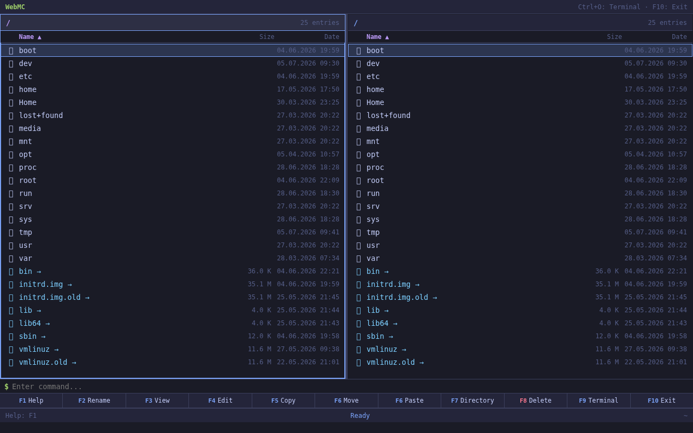

# WebMC

A web-based file manager inspired by Midnight Commander.  
Runs on any machine with Node.js — no dependencies, no npm install needed.



## Features

- **Dual-panel layout** — browse two directories side by side
- **Keyboard-driven** — full F1–F10, arrow keys, and command-line interface
- **Built-in Terminal** — execute shell commands directly in the browser
- **Inline Editor** — edit text files with save support (Ctrl+Enter to save)
- **File Operations** — copy, move, rename, delete, create directories
- **Marking** — select multiple files for batch operations
- **Drag & Drop Upload** — drag files from your desktop into the browser
- **Download** — single files or multi-file archives (.tar.gz)
- **Search** — find files by glob patterns (e.g. `*.txt`)
- **Context Menu** — right-click for quick actions
- **PWA Ready** — can be installed as a progressive web app
- **Docker Support** — ready-to-run container image
- **i18n** — English and German UI (configurable)

## Quick Start

```bash
node server.js
```

Then open http://localhost:4500 in your browser.

## Usage

```bash
node server.js [port] [--left <path>] [--right <path>]

Examples:
  node server.js                    # port 4500, panels: / and /
  node server.js 8080              # port 8080
  node server.js --left /home --right /tmp
  node server.js 8080 --left /etc --right /var/log
```

## Configuration

Edit `config.json` in the project root:

```json
{
  "port": 4500,
  "leftPanel": "/",
  "rightPanel": "/",
  "language": "en"
}
```

- `port` — HTTP server port (default: 4500)
- `leftPanel` — default left panel path
- `rightPanel` — default right panel path
- `language` — UI language: `"en"` (English) or `"de"` (German)

Command-line arguments override `config.json` values.  
The language is loaded from config on startup. Changing the value requires a server restart.

## Keyboard Shortcuts

| Key | Action |
|---|---|
| F1 | Help |
| F2 | Rename |
| F3 | View file |
| F4 | Edit file |
| F5 | Copy |
| F6 | Move |
| F7 | New directory |
| F8 | Delete |
| F9 | Terminal |
| F10 | Exit |
| Tab | Switch panel |
| ↑/↓ | Move cursor |
| PgUp/PgDn | Page up/down |
| Home/End | Beginning/End |
| Ins | Toggle mark |
| + | Mark all |
| \ | Invert selection |
| Ctrl+O | Terminal |
| Ctrl+R | Search |
| Ctrl+L | Refresh |
| Ctrl+\\ | Invert selection |
| Alt+Enter | Open in other panel |
| : | Open command line |

## Docker

```bash
docker build -t webmc .
docker run -p 4500:4500 \
  -v /:/mnt:ro \
  -e CONFIG='{"port":4500,"leftPanel":"/mnt","language":"en"}' \
  webmc
```

## License

MIT — do what you want with it.
